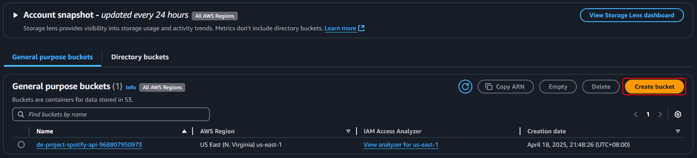
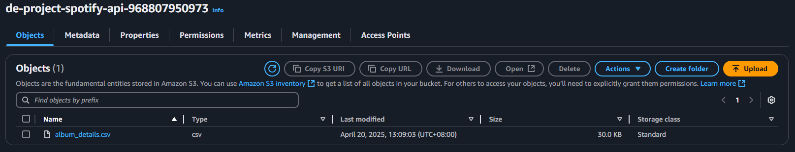

## Batch Data Processing with Spotify API

This project demonstrates an end-to-end pipeline for batch data processing using the Spotify API, Python, and AWS S3. 
It involves retrieving data on newly released albums, transforming the data into a structured format, and storing it in an Amazon S3 bucket for further analysis or visualization.

### Step 1: Installing Necessary Modules

To set up the Python environment for this project, the following modules must be installed. 
These libraries handle API requests, data transformation, environment variables, and interactions with AWS S3.

**Install the required modules using** `pip`:

```bash
pip install requests pandas boto3 python-dotenv
```

#### Modules Explanation:

- `requests`: Handles HTTP requests to interact with the Spotify API.
- `requests.auth (HTTPBasicAuth)`: Enables secure authentication for API requests.
- `pandas`: Processes and transforms JSON data into structured tabular data for export.
- `boto3`: Provides an interface to interact with AWS S3 for uploading files.
- `python-dotenv`: Manages environment variables securely by loading them from a `.env` file.

### Step 2: Creating the S3 Bucket

Before uploading data, an Amazon S3 bucket must be created to store the processed information. Using the AWS Management Console:
- Navigate to the S3 service and click Create Bucket.
- Enter the bucket name `de-project-spotify-api-968807950973` and create bucket.

<div align="center">
    
</div>

### Step 3: Paginated Data Retrieval

Spotify's `Get New Releases` endpoint provides data in a paginated format, meaning multiple requests are needed to fetch all available results. 
The `get_paginated_new_releases` function in `endpoint.py` handles pagination efficiently by looping through pages until all data is collected.

#### Function Initialization

Import the library and define the function `get_paginated_new_releases`.
The function is responsible for retrieving and aggregating all data across multiple API pages.

``` python
import requests

# Function to perform authenticated API requests
def get_paginated_new_releases(base_url: str, access_token: str) -> list:

    # Set up Authorization
    headers = {"Authorization": f"Bearer {access_token}"}

    # Starts with the base URL and will later track the URL for each paginated request
    request_url = base_url

    # An empty list to store the collected album data from multiple API responses
    new_releases_data = []
```

- **Authorization Header:** The `access_token` authenticates API requests and ensures secure access to Spotify's data.
- **Base URL:** The Spotify endpoint serves as the starting point for data retrieval.

#### API Pagination and Data Collection

The function iterates through each page of the API's response using the `next` field.

``` python
    # Executes as long as request_url is valid
    while request_url:

        # API `GET` request to the API using the current `request_url` and the prepared headers
        response = requests.get(url=request_url, headers=headers)

        # Check for request success
        if response.status_code != 200:
            print(f"Error: Status code {response.status_code}")
            break

        # Extract album data from the "albums" key and append to list
        response_json = response.json()
        new_releases_data.extend(response_json.get("albums", {}).get("items", []))

        # Update with the next page URL
        request_url = response_json.get("albums", {}).get("next")
```

- **Pagination:** The `next` field in the response provides the URL for the next set of results, which is iteratively updated until no more data remains.
- **Data Collection:** Extracts and appends album data from each response into `new_releases_data`.

### Step 4: Setting Up the Main Script

The `main.py` script orchestrates the pipeline, including authentication, data transformation, and cloud storage.

#### Importing libraries

``` python
import requests            
import os
import io              
import pandas as pd        
import boto3

# For Spotify API authentication  
from requests.auth import HTTPBasicAuth

 # For loading environment variables securely
from dotenv import load_dotenv

# For paginated data retrieval                   
from endpoint import get_paginated_new_releases  
```

#### Authentication

The Spotify API requires authentication using client credentials. 

The credentials (`CLIENT_ID` and `CLIENT_SECRET`) are stored securely in a `.env` file and loaded at runtime.

``` python
load_dotenv("./env", override=True)

# Retrieve CLIENT_ID and CLIENT_SECRET from env file
CLIENT_ID = os.getenv("CLIENT_ID", "")
CLIENT_SECRET = os.getenv("CLIENT_SECRET", "")
```

The token is obtained by making a `POST` request to Spotify's Accounts API.

``` python
# URL for URL_TOKEN
URL_TOKEN = "https://accounts.spotify.com/api/token"

# POST request
response = requests.post(
    "https://accounts.spotify.com/api/token",
    auth=HTTPBasicAuth(CLIENT_ID, CLIENT_SECRET),
    data={"grant_type": "client_credentials"}
)

# Extract the token from the response JSON
token = response.json().get("access_token")
```
This token is essential for accessing Spotify's endpoints, such as the `Get New Releases` API.

#### Data Retrieval

The `get_paginated_new_releases` function is called to retrieve all new album releases.

``` python
# URL for URL_NEW_RELEASES
URL_NEW_RELEASES = "https://api.spotify.com/v1/browse/new-releases"

# Retrieve all new album releases
new_releases = get_paginated_new_releases(
    base_url="https://api.spotify.com/v1/browse/new-releases",
    access_token=token
)
```

#### Data Transformation

The retrieved JSON data is flattened to extract key information about albums and their associated artists. 
This structured format simplifies further storage and analysis.

``` python
# Iterates through a list of albums and their associated artists
flattened_album_details = [
    {
        "album_id": album["id"],
        "album_name": album["name"],
        "release_date": album["release_date"],
        "album_spotify_url": album["external_urls"]["spotify"],
        "artist_id": artist["id"],
        "artist_name": artist["name"],
        "artist_spotify_url": artist["external_urls"]["spotify"],
    }
    for album in new_releases
    for artist in album.get("artists", [])
]

# Convert flattened data into a pandas DataFrame
df = pd.DataFrame(flattened_album_details)
```

**Key Fields Extracted:**
- **Album Details:** `album_id`, `album_name`, `release_date`, `album_spotify_url`
- **Artist Details:** `artist_id`, `artist_name`, `artist_spotify_url`

Using a Python list comprehension, the nested JSON data is flattened by extracting specific details about each album and its associated artists.
This ensures that the data is in a tabular form, making it suitable for exporting as a CSV file for further use. 
The approach simplifies working with complex API responses and prepares the data for storage or analysis.

#### Uploading Data to Amazon S3 Bucket

The flattened data is converted to CSV format and uploaded to the S3 bucket.

``` python
# Convert the DataFrame to CSV format in memory
df = pd.DataFrame(flattened_album_details)
csv_buffer = io.StringIO()
df.to_csv(csv_buffer, index=False, encoding="utf-8")
    
# Retrieve AWS_BUCKET_NAME from env file
AWS_BUCKET_NAME = os.getenv("AWS_BUCKET_NAME", "")

# Upload CSV to S3 Bucket
s3 = boto3.client('s3')
s3.put_object(
  Bucket=AWS_BUCKET_NAME,
  Key="album_details.csv",
  Body=buffer.getvalue(),
  ContentType='text/csv',
  ContentEncoding='UTF-8'
)
```

Navigate to the S3 bucket on the AWS Management Console. 
Under the Objects tab, we should see the album_details.csv file listed as shown below.

<div align="center">
    
</div>

### Summary and Future Improvements
#### Key Workflow Summary:
1. Authentication: Securely access the Spotify API using OAuth 2.0.
2. Data Retrieval: Retrieve paginated data using the Get New Releases endpoint.
3. Data Transformation: Flatten nested JSON data into a structured format.
4. Data Storage: Upload processed data directly to an Amazon S3 bucket.

#### Future Improvements:
1. Automate Pipeline: Use AWS Lambda or Apache Airflow to schedule periodic data extraction.
2. Data Modeling: Convert raw data into dimensional models for advanced analysis.
3. Visualization: Use Amazon QuickSight to create dashboards showcasing album trends and artist activity.


